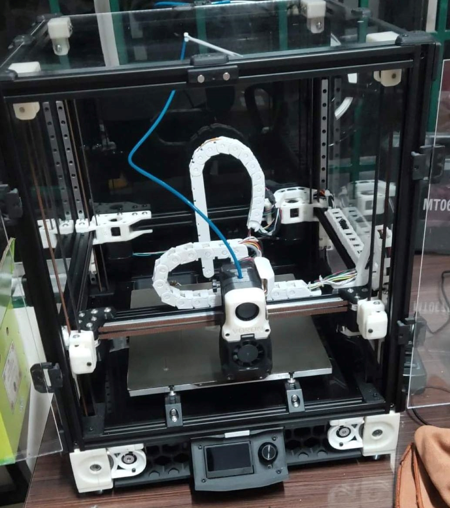

# Voron2.4-Config
My backup Voron 2.4 config that contains instructions- 250x250x250



## 🎯Wiring
B stepper motor → Driver0\
A stepper motor → Driver1\
Z0 (front left) stepper motor → Driver2-2 (leaving an empty connector between B/A and Z0)\
Z1 (rear left) stepper motor → Driver3\
Z2 (rear right) stepper motor → Driver4\
Z3 (front right) stepper motor → Driver5\
Extruder stepper motor → Driver7 (leaving an empty connector between Z3 and extruder)\
Filament Runout Sensor → X-\
X endstop switch → X+\
Y endstop switch → Y+\
Z endstop switch → Z-\
Inductive probe (with BAT85) → Z+\
Bed thermistor → TB\
Hotend thermistor → TH0\
Chamber thermistor → TH1\
Frame thermistor → TH2\
Hotend fan → FAN0 (See markings on back of board)\
Print cooling fan → FAN1 (See markings on back of board)\
Exhaust fan → FAN2 (See markings on back of board)\
MKS Mini 13864 v3 → EXP1 and EXP2\
SSR input → H-BED (See markings on back of board)\
Hotend heater → HE0\
Controller fan → HE1\
Single-colour 24V LED strip → HE2


## Required jumper settings
Endstop - PWR → VIN\
SPI/UART → UART configuration (see back of board)\
Driver DIAG → No jumpers installed\
Drive IC - PWR → 5V

## jumper settings
USB-PWR → OFF

## Other jumper settings
Each fan connector has a corresponding FAN-PWR jumper, which allows each individual fan to be
ran with 5V, 12V, or 24V. 
## Klipper config
```
[*] Enable extra low-level configuration options
    Micro-controller Architecture (STMicroelectronics STM32)  --->
    Processor model (STM32F407)  --->
    Bootloader offset (48KiB bootloader (MKS Robin Nano V3))  --->
    Clock Reference (8 MHz crystal)  --->
    Communication interface (USB (on PA11/PA12))  --->
    USB ids  --->
()  GPIO pins to set at micro-controller startup
```


##👨🏻‍💻 Other links
[Voron-Design](https://github.com/VoronDesign/Voron-2)\
[Super-Slicer](https://github.com/supermerill/SuperSlicer)
[MKS Monster8 Voron config by makerbase](https://github.com/makerbase-mks/MKS-Monster8/blob/main/klipper%20firmware/Voron%202.4%20config/printer.cfg)